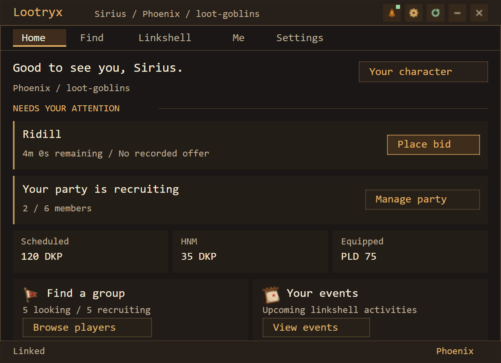
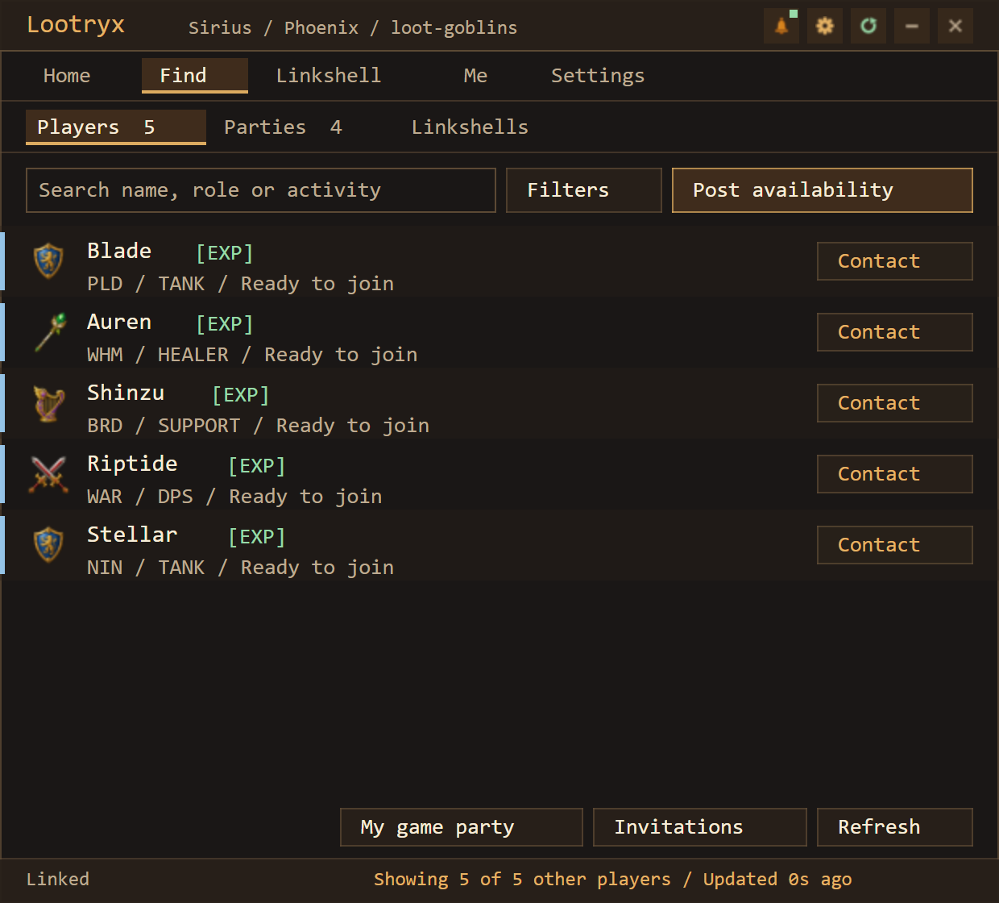
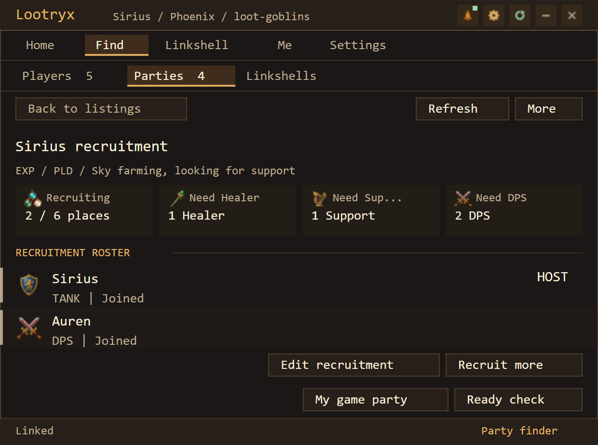
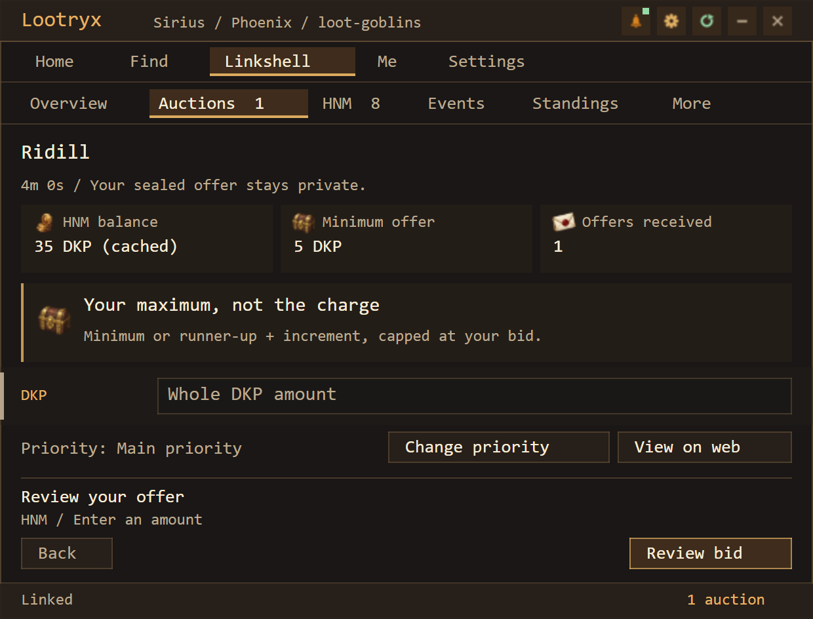
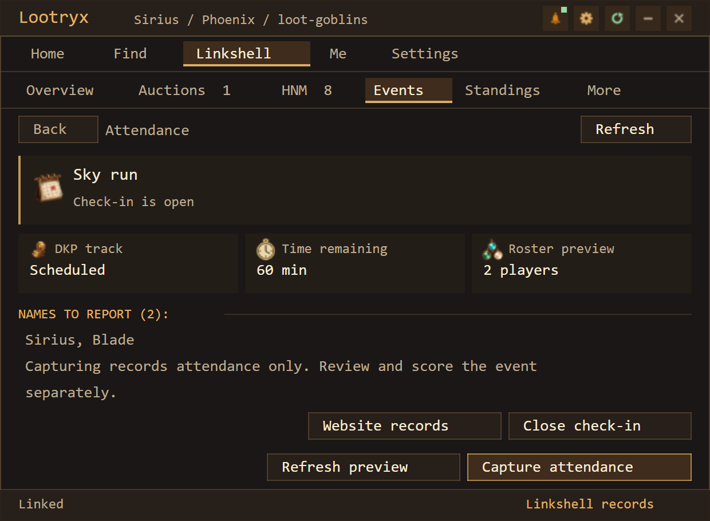
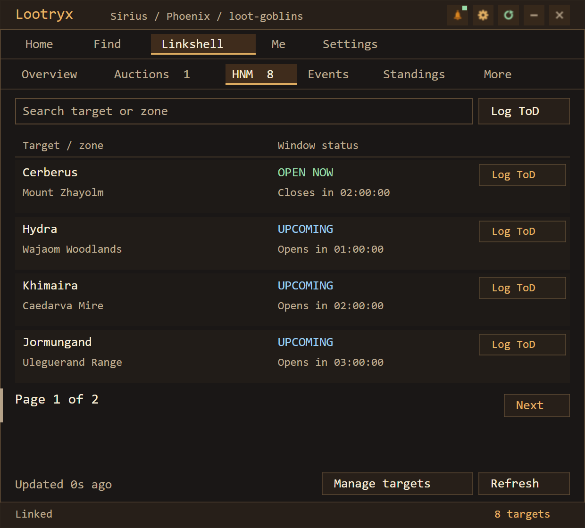

# Lootryx Addon

Lootryx is a community platform for Final Fantasy XI, bringing together party finding,
linkshell management, events, DKP and loot distribution at **[lootryx.com](https://lootryx.com)**.

The addon brings these tools into the game through Windower 4 and Ashita v4,
so you can find groups and keep up with your linkshell while playing.

## Download

| Windower 4 | Ashita v4 |
| --- | --- |
| **[Download for Windower 4](https://github.com/sssiriusly/lootryx-addon/releases/download/v0.40.31/Lootryx-v0.40.31-Windower.zip)** | **[Download for Ashita v4](https://github.com/sssiriusly/lootryx-addon/releases/download/v0.40.31/Lootryx-v0.40.31-Ashita.zip)** |
| `//lua load lootryx` | `/addon load lootryx` |

Extract the ZIP and copy its `lootryx` folder into your loader's `addons` folder.
Each download includes installation instructions for that loader. Both contain the
same shared addon runtime, which detects Windower or Ashita automatically.

[Release notes and checksums](https://github.com/sssiriusly/lootryx-addon/releases/tag/v0.40.31)
 · [Full installation guide](docs/INSTALL.md)

*Addon previews shown with demo data. These use the shared Lua layouts rendered in a
browser; native fonts and rendering may differ.*

## Find players and parties

Post your availability or recruit members for your next run. Browse players and parties,
filter by activity and role, and specify how many tanks, healers, support or damage
dealers your party needs. Lootryx recruitment is separate from your actual game party.

Prepare tells and party commands, then review and send them yourself.

## Your linkshell, in game

- **Auctions:** Browse auctions, place or update bids and view results. A maximum bid
  may differ from the final charge under your linkshell's auction rules.
- **DKP:** Check balances and standings, including separate tracks when enabled.
- **Events and attendance:** View events and capture attendance during an open check-in.
  Authorized officers can start scheduled or unscheduled events and manage check-in.
  Capture records attendance; review and scoring are separate.
- **HNM windows:** View tracked targets and manually report a witnessed time of death.
- **Notifications:** Follow supported auction, recruitment, party and check-in updates.
  Delivery depends on the relevant refresh settings and successful service requests.

Available actions follow your linkshell permissions.

## Connected to your Lootryx account

Link your character to access personal and linkshell information. The website provides
broader planning, administration and record review. The addon also offers explicit local
macro-book upload and download tools; downloads modify local macro files after review.

## Install

See the [installation guide](docs/INSTALL.md). Both Windower 4 and Ashita v4 have
been tested in game.

## How the addon interacts with FFXI

The addon reads supported client state and sends selected reports to Lootryx. It does
not automate movement, targeting, combat, lot/pass, or submit chat commands. Explicit
chat actions read/preserve the current draft and write only the local input buffer;
the player submits it. Optional macro downloads write the player's local macro files.
It also writes addon settings, an item-icon cache and explicitly exported result text.

The [GM audit guide](docs/GAME-INTERACTION.md) maps reads, local writes, network traffic,
background behavior and dependencies to source files.

Phoenix staff reviewed this addon and approved it for use on Phoenix. Any change to
its features is resubmitted for review before release; cosmetic changes are not.

## Documentation and feedback

- [Install, pair, update and troubleshoot](docs/INSTALL.md)
- [Game interaction and GM audit guide](docs/GAME-INTERACTION.md)
- [Testing and release verification](docs/VALIDATION.md)
- [Website documentation](https://lootryx.com/docs/addon)
- [Report an issue](https://github.com/sssiriusly/lootryx-addon/issues)

For bug reports, include the addon version, loader/version, screen or command, expected
behavior and exact error. Remove pairing codes, secrets and private member information.
Do not attach settings files. See [SECURITY.md](SECURITY.md) for security reporting.

## License

[Source-available, with restrictions](LICENSE), not open source. Player use, source
inspection and private modifications are permitted. Resale, commercial code reuse and
redistribution require permission, subject to the license's exceptions. Ordinary use in
monetized gameplay videos or streams is permitted. Third-party material retains its own
terms: [third-party notices](THIRD-PARTY-NOTICES.md).
